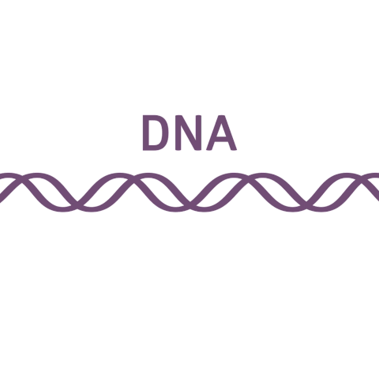

## Nice to meet you!

   

❤️ Hello! I am Yuelin, a postdoctoral fellow at the University of Cambridge, in the Department of Clinical Neurosciences and the MRC Mitochondrial Biology Unit, where I work with Professor Patrick Chinnery.

🧬 💻 My research focuses on applying computational and statistical techniques to investigate the molecular mechanisms underlying disease initiation and progression using single-cell data, with a particular interest in cellular responses and state transitions associated with mitochondrial dysfunction ⚡️. In addition, I have experience in estimating mutational interactions across pan-cancer using a model-free approach with the whole genome sequencing data. Areas of interest also include comparative transcriptomics and population genomics 👫 🐂 🐖. 

Before that, I was a PhD at the [School of Informatics](https://www.ed.ac.uk/informatics), University of Edinburgh, and [MRC Human Genetics Unit](https://www.ed.ac.uk/mrc-human-genetics-unit), Institute of Genetics and Cancer, where I was supervised by Dr. [Ava Khamseh](https://edbiomed.ai/people/) (primary), Professor [Chris Ponting](https://www.ed.ac.uk/profile/chris-ponting) and Dr. [Luke Boulter](https://www.ed.ac.uk/profile/luke-boulter). 

🏓 🏃‍♀️ 🎵 🎤 🎨 ✈️ 🦋 🥖 🎲 📸 📖 🎬 🍿 When I am not in the lab, I enjoy doing sports, drawing, traveling, baking... A few of those are listed in Blog.

Feel free to get in touch if you want to learn more about me! ☕️ 😃

## Education
<table><tbody>
  <tr>
    <td> 🎓 Nov. 2020 - Aug. 2024 </td>
    <td>
      Ph.D. in Bioinformatics at the University of Edinburgh 
      Supervisors: <a href="https://edbiomed.ai/people/" target="_blank">Ava Khamseh</a>, <a href="https://www.ed.ac.uk/profile/chris-ponting" target="_blank">Chris Ponting</a> and <a href="https://www.ed.ac.uk/profile/luke-boulter" target="_blank">Luke Boulter</a>
    </td>
  </tr>
  <tr>
    <td> 🎓 2019 - 2020</td>
    <td>
      M.Sc. (Distinction) in Bioinformatics at the University of Edinburgh 
      Supervisor: <a href="https://scholar.google.com/citations?user=cgcFdCkAAAAJ&hl=en">Lingzhao Fang</a>
    </td>
  </tr>
  <tr>
    <td> 🎓 2015 - 2019</td>
    <td>
      B.Sc. (Honours) in Plant Protection at Zhejiang University 
      Supervisor: Yanyuan Bao
      </td>
  </tr>
</tbody>
</table>

